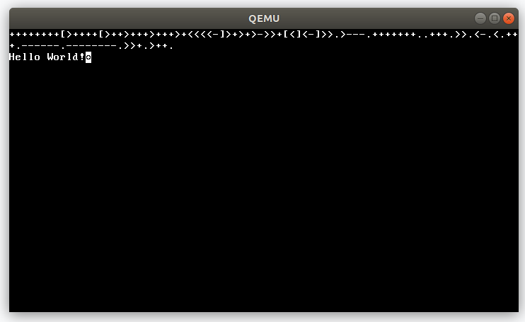
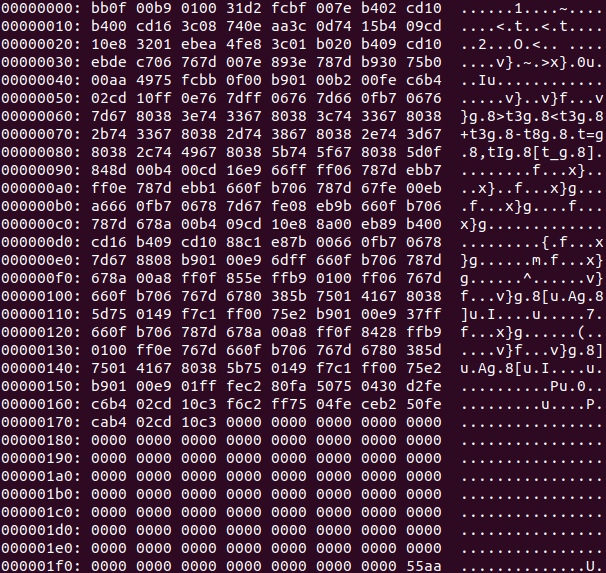

# Bootfuck
Bootfuck is a Brainfuck interpreter that fits in the 510 bytes avaliable space of a boot sector.
The whole interpreter including a small text editor uses only 374 bytes of space.
Bootfuck is loaded after the BIOS, but before any operating system making it a small OS itself.

Here is a small example of how the Bootfuck interpreter looks like when running the Hello World example code from the [Wikipedia article](https://en.wikipedia.org/wiki/Brainfuck#Hello_World!) on Brainfuck:

And here is a screenshot of the whole binary produced by NASM:

# Running Bootfuck
If you already have NASM and qemu installed, the interpreter can be simply run by running `make run` in the project directory.
Make will then first build the binaries from source and then pass them to qemu.

If you want to debug the program, run `make debug` in the project directory. Make will then compile the source, run qemu and start GDB already connected to the VM. It will then run the BIOS and break at the start of the code from Bootfuck. Furthermore, a few convenience variables will be defined:

Variable           | Description
------------------ | -----------
$pcb               | Address of the program counter of the Brainfuck code
$dpb               | Address of the data pointer pointing to the current cell of the tape
$code              | Start of the brainfuck code entered by the user
$GetInput          | Address of the start of the text editor contained in Bootfuck
$AllocateWorkspace | Address of the start of the routine to fill the tape with zeros
$RunCode           | Address of the start of the code to run the code previously entered by the user
$ni                | Address of the start of the code to interpret the next brainfuck instruction
